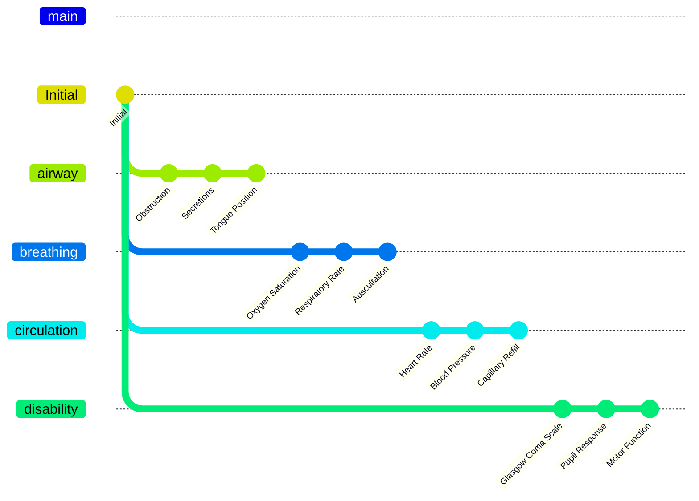
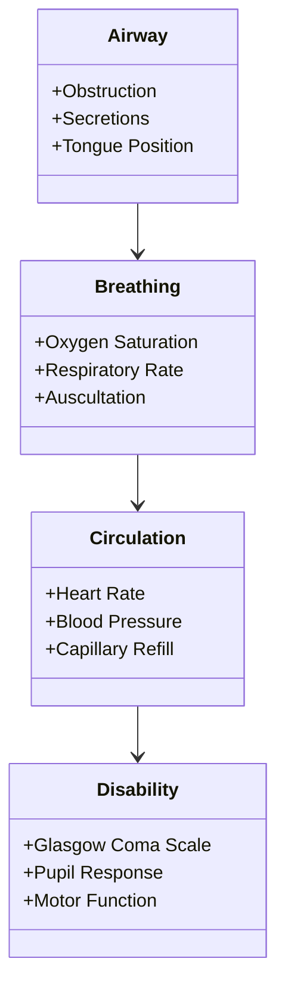

## Airway

## Breathing

## Circulation

## Disability

```mermaid
gitGraph
	branch Initial
   commit id: "Initial"
   branch airway
   checkout airway
   commit id: "Obstruction"
   commit id: "Secretions"
   commit id: "Tongue Position"
   
   checkout Initial
   branch breathing
   checkout breathing
   commit id: "Oxygen Saturation"
   commit id: "Respiratory Rate"
   commit id: "Auscultation"
   
   checkout Initial
   branch circulation
   checkout circulation
   commit id: "Heart Rate"
   commit id: "Blood Pressure"
   commit id: "Capillary Refill"
   
   checkout Initial
   branch disability
   checkout disability
   commit id: "Glasgow Coma Scale"
   commit id: "Pupil Response"
   commit id: "Motor Function"

```

```mermaid
classDiagram
   class Airway {
     +Obstruction
     +Secretions
     +Tongue Position
   }
   
   class Breathing {
     +Oxygen Saturation
     +Respiratory Rate
     +Auscultation
   }
   
   class Circulation {
     +Heart Rate
     +Blood Pressure
     +Capillary Refill
   }
   
   class Disability {
     +Glasgow Coma Scale
     +Pupil Response
     +Motor Function
   }
Airway --> Breathing 
Breathing --> Circulation
Circulation --> Disability
```

[^1]:
[^2]:
[^3]:
[^4]: